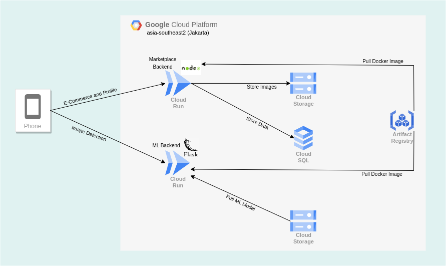
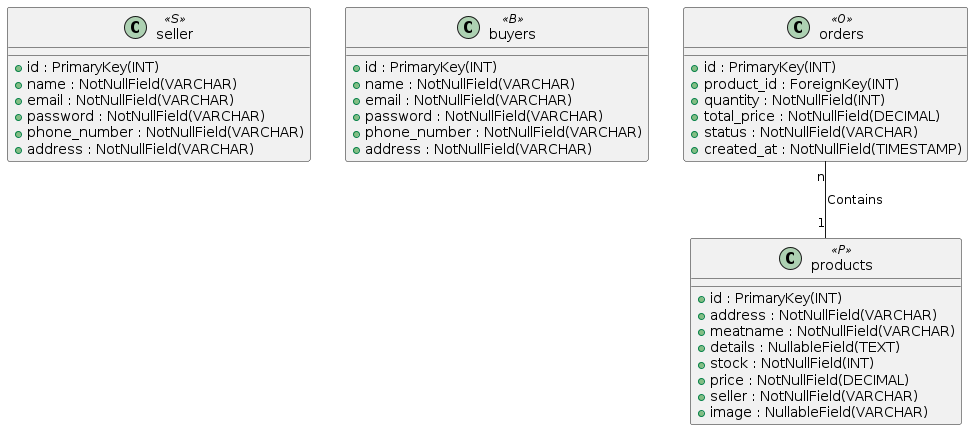

# MeatMe Backend API

This projects have purpose to creating an API that will be consumed by the frontend such as android mobile apps.

## Tech Stack
**Server:** Google Cloud Platform, Node.js, Express, Flask


## Pictures
### a. Cloud Architecture



### b. Database Design



## Environment Variables

To run this project, you will need to create .env file for storing credentials. Please use an example like [this](https://github.com/meatme-bangkit/CC-MeatMe/blob/main/src-backend-marketplace/.env.example)

Filled in all of those ```key=value```, just set the value

`PORT`

`DB_HOST`

`DB_USER`

`DB_PASSWORD`

`DB_NAME`

`JWT_SECRET`

`PROJECT_ID`

`KEYFILE`

`BUCKET_NAME`

After that, save it on **(src-backend-marketplace)** folder project.

## IMPORTANT!
1. Before replicate this projects, please make sure to provision some infrastructure in Google Cloud. Like CloudSQL (MySQL) and Google Cloud Storage.

2. Make a service account

    `IAM - Service Accounts - Create Service Account - Grant this service account - Role (Cloud Storage - Storage Object Creator) - Done`

    `Click three dots on right - Manage Keys - Add Key - Create New Key - JSON - Create`

Save this json file to projects folder. **(src-backend-marketplace)**


### Installation
1. Clone this project
```
  git clone https://github.com/meatme-bangkit/CC-MeatMe.git
```

2. For Backend Marketplace
```
  cd CC-MeatMe/src-backend-marketplace
  docker build -t backend-api:v1 .
```

3. For ML API
```
  cd ../src-ml-api
  docker build -t ml-api:v1 .
```


## Deployment
To deploy this project locally, run

```
  docker run -p 3000:3000 -itd backend-api:v1
  docker run -p 5000:5000 -itd ml-api:v1
```
And now, you can use [postman](https://www.postman.com/downloads/) or other REST tools to test those API's


## API Reference

### xx AS BUYERS xx

#### Sign Up Accounts for Buyers

```
  POST /api/signup
```

| Body | Type     | Description                |
| :-------- | :------- | :------------------------- |
| `name` | `string` | **Required**. Your Name |
| `email` | `string` | **Required**. Your Valid Email |
| `password` | `string` | **Required**. Your Password |
| `phone_number` | `string` | **Required**. Your Phone Number |
| `address` | `string` | **Required**. Your Address |

#### Sign In Accounts for Buyers

```
  POST /api/signin
```

| Body | Type     | Description                |
| :-------- | :------- | :------------------------- |
| `email` | `string` | **Required**. Your Valid Email |
| `password` | `string` | **Required**. Your Password |


#### Retrieve Buyer Profile Info

```
  GET /api/profile/:email
```

| Authorization | Type     | Description                |
| :-------- | :------- | :------------------------- |
| `Bearer Token` | `string` | **Required**. Your Valid Token |


#### Retrieve All Products Items

```
  GET /api/products
```

#### Search Product/Item

```
  GET /api/products/search/:meatname
```

#### Details Product/Item

```
  GET /api/products/:meatname
```

#### Make an Order

```
  POST /api/order
```
| Authorization | Type     | Description                |
| :-------- | :------- | :------------------------- |
| `Bearer Token` | `string` | **Required**. Your Valid Token |

| Body | Type     | Description                |
| :-------- | :------- | :------------------------- |
| `productId` | `string` | ID Item which You Want to Buy |
| `quantity` | `string` | Quantity of Item which You Want to Buy |

#### Update Status Info

```
  PUT /api/order/:orderId
```
| Authorization | Type     | Description                |
| :-------- | :------- | :------------------------- |
| `Bearer Token` | `string` | **Required**. Your Valid Token |

| Body | Type     | Description                |
| :-------- | :------- | :------------------------- |
| `status` | `string` | Status of Order (example: "delivered") |

#### View Order 

```
  GET /api/order/:orderId
```
| Authorization | Type     | Description                |
| :-------- | :------- | :------------------------- |
| `Bearer Token` | `string` | **Required**. Your Valid Token |

---
---
---
### xx AS SELLERS xx

#### Register Accounts for Sellers
```
  POST /api/register
```

| Body | Type     | Description                |
| :-------- | :------- | :------------------------- |
| `name` | `string` | **Required**. Your Name |
| `email` | `string` | **Required**. Your Valid Email |
| `password` | `string` | **Required**. Your Password |
| `phone_number` | `string` | **Required**. Your Phone Number |
| `address` | `string` | **Required**. Your Address |

#### Login Accounts for Sellers

```
  POST /api/login
```

| Body | Type     | Description                |
| :-------- | :------- | :------------------------- |
| `email` | `string` | **Required**. Your Valid Email |
| `password` | `string` | **Required**. Your Password |


#### Retrieve Seller Profile Info

```
  GET /api/profileSeller/:email
```

| Authorization | Type     | Description                |
| :-------- | :------- | :------------------------- |
| `Bearer Token` | `string` | **Required**. Your Valid Token |


#### Make a Product
```
  POST /api/products
```
| Authorization | Type     | Description                |
| :-------- | :------- | :------------------------- |
| `Bearer Token` | `string` | **Required**. Your Valid Token |

| Body Form | Type     | Description                |
| :-------- | :------- | :------------------------- |
| `address` | `string` | **Required**. Location of Seller |
| `meatname` | `string` | **Required**. Name of Meat Item |
| `details` | `string` | **Required**. Details of Meat Item |
| `stock` | `int` | **Required**. Stock of Meat Item |
| `price` | `int` | **Required**. Price of Meat Item |
| `seller` | `string` | **Required**. Seller of Meat Item |
| `image` | `file` | **Required**. File image of Meat Item |

#### Change Data Product
```
  PUT /api/products/:id_product
```
| Authorization | Type     | Description                |
| :-------- | :------- | :------------------------- |
| `Bearer Token` | `string` | **Required**. Your Valid Token |

| Body  | Type     | Description                |
| :-------- | :------- | :------------------------- |
| `address` | `string` | Location of Seller |
| `meatname` | `string` | Name of Meat Item |
| `details` | `string` | Details of Meat Item |
| `stock` | `int` | Stock of Meat Item |
| `price` | `int` | Price of Meat Item |

#### Delete Data Product
```
  DELETE /api/products/:id_product
```
| Authorization | Type     | Description                |
| :-------- | :------- | :------------------------- |
| `Bearer Token` | `string` | **Required**. Your Valid Token |

#### Sellers Get Order Info from Buyers
```
  GET /api/orders
```
| Authorization | Type     | Description                |
| :-------- | :------- | :------------------------- |
| `Bearer Token` | `string` | **Required**. Your Valid Token |


---
---
---
#### Image Detection
```
  POST /predict
```

| Body | Type     | Description                       |
| :-------- | :------- | :-------------------------------- |
| `image`      | `file` | **Required**. File image to be detect |


